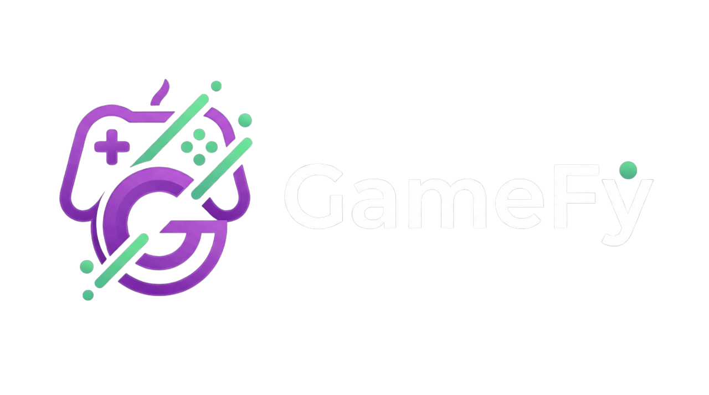
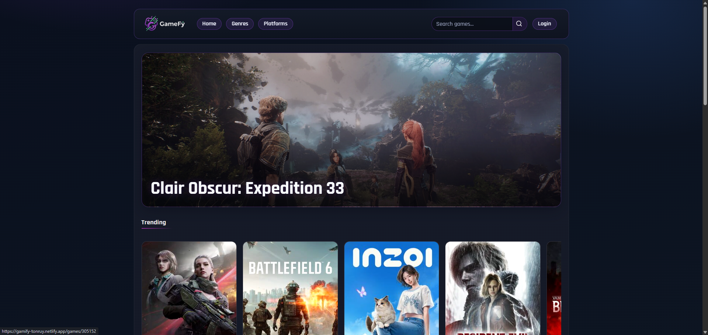
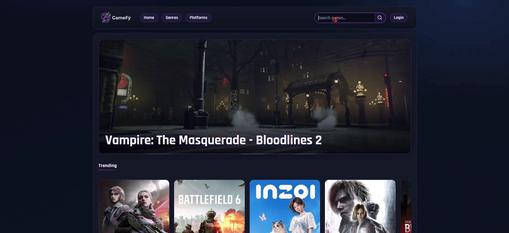
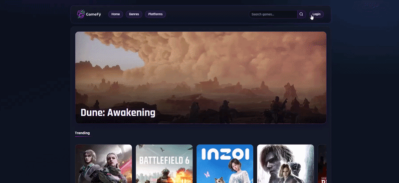

# GameFy

<p align="center">
  
</p>

<p align="center">
  <strong>Discover, search, and track video games with a modern full-stack web application powered by IGDB.</strong>
</p>

<p align="center">
  <a href="https://gamify-tonruy.netlify.app/">Live Demo</a> ·
  <a href="https://github.com/Tonruy/GameFy">Repository</a>
</p>

---

## Preview

<table align="center">
<tr>
<td align="center" width="50%">

**Home**



</td>
<td align="center" width="50%">

**Search**



</td>
</tr>
</table>

<table align="center">
<tr>
<td align="center" width="100%">

**Main Flow**



</td>
</tr>
</table>

---

## Overview

GameFy is a full-stack web application developed by Antonio Ruiz that allows users to discover trending and upcoming games, explore detailed information, and manage a personal account with favorites and wishlist features.

The project simulates a real product-oriented application combining a responsive frontend, a modular backend architecture, external API integration, authentication, and user-specific functionality.

---

## Features

- Real-time game discovery (`Trending`, `Incoming`, `Top Rated`, `Discover`, `New Releases`)
- Fast header search with suggestions
- Detailed game pages with screenshots, trailers, and similar titles
- Dynamic catalogs by genre and platform with pagination
- JWT-based authentication (`register` / `login`)
- User dashboard with profile update and account deletion
- Favorites system synced with the user account
- Wishlist system synced with the user account

---

## Tech Stack

| Layer | Stack |
|------|------|
| Frontend | React, React Router, Vite |
| Backend | Node.js, Express |
| Database | MongoDB, Mongoose |
| Auth | JWT, bcryptjs |
| External APIs | Twitch OAuth, IGDB |
| Testing | Jest, Supertest |

---

## Architecture

The backend follows a modular architecture designed to keep responsibilities clearly separated.

- **Controllers** handle HTTP requests and responses  
- **Services** contain business logic and API orchestration  
- **Infrastructure** manages integrations such as Twitch OAuth and IGDB communication  

This structure improves maintainability, scalability, and code clarity.

---

## Project Structure

```
GAMEFY/
├── backend/
│   └── src/
├── frontend/
│   └── src/
└── docs/
```

---

## What I Learned

Through this project I strengthened my skills in:

- Building a full-stack application with React and Express
- Designing a modular backend architecture
- Integrating external APIs with authenticated requests
- Implementing JWT-based authentication
- Managing protected routes and user-specific data
- Structuring a real-world application with scalability in mind

---

## Prerequisites

Before running the project locally you need:

- Node.js 20+
- npm
- MongoDB instance (local or MongoDB Atlas)
- Twitch Developer credentials for IGDB access

---

## Environment Variables

### Backend (`backend/.env`)

```env
PORT=3001
MONGO_URI=mongodb+srv://...
TWITCH_CLIENT_ID=your_twitch_client_id
TWITCH_CLIENT_SECRET=your_twitch_client_secret
IGDB_BASE_URL=https://api.igdb.com/v4
ACCESS_TOKEN_SECRET=your_access_secret
REFRESH_TOKEN_SECRET=your_refresh_secret
ACCESS_TOKEN_EXPIRES_IN=15m
REFRESH_TOKEN_EXPIRES_IN=60m
```

### Frontend (`frontend/.env`)

```env
VITE_API_BASE_URL=http://localhost:3001
```

---

## Getting Started

### Clone the repository

```bash
git clone https://github.com/Tonruy/GameFy.git
cd GameFy
```

### Run the backend

```bash
cd backend
npm install
npm run dev
```

Backend URL

```
http://localhost:3001
```

Health endpoint

```
GET /health
```

### Run the frontend

```bash
cd frontend
npm install
npm run dev
```

Frontend URL

```
http://localhost:5173
```

---

## Scripts

### Backend

- `npm run dev` — start development server with nodemon  
- `npm start` — start server in production-like mode  
- `npm test` — run backend tests  
- `npm run seed:users` — seed users  

### Frontend

- `npm run dev` — start Vite development server  
- `npm run build` — build for production  
- `npm run preview` — preview production build  
- `npm run lint` — run ESLint  

---

## API Overview

### Public Routes

```
GET /api/games/trending
GET /api/games/new
GET /api/games/incoming
GET /api/games/discover
GET /api/games/top-rated
GET /api/games/search?searchQuery=...
GET /api/games/:gameId
GET /api/games/:gameId/similar
GET /api/games/genre/:genreId
GET /api/games/platform/:platformId
GET /api/catalog/genres
GET /api/catalog/platforms
POST /api/auth/register
POST /api/auth/login
```

### Protected Routes (require auth-token header)

```
GET /api/users/me
PATCH /api/users/me
DELETE /api/users/me
GET /api/users/me/favorites
POST /api/users/me/favorites/:gameId
DELETE /api/users/me/favorites/:gameId
GET /api/users/me/wishlist
POST /api/users/me/wishlist/:gameId
DELETE /api/users/me/wishlist/:gameId
```

---

## Notes

- CORS is currently configured for `http://localhost:5173`
- Frontend stores authentication tokens in localStorage:

```
gamefy_access_token
gamefy_refresh_token
```

---

## Roadmap

Planned improvements include:

- Integration of an AI-powered in-app chatbot assistant
- Newsletter API for user subscriptions and updates
- Additional personalization features
- Continued improvements to architecture and scalability

---

## Author

**Antonio Ruiz**  
Full Stack Developer  

GitHub  
https://github.com/Tonruy  

LinkedIn  
https://www.linkedin.com/in/antonio-ruiz-molina-tonruy/
